# Project Background (& Overview)

A Power BI project that analyzes the car sales of 10 dealerships from South Africa and Botswana during 2022.The dataset that was used in this project was acquired from Kaggle and here is the link to the dataset: https://www.kaggle.com/datasets/teresiawangari/top-cars-south-africa
The aim of this project is to find the best performing dealerships amongst the 10 dealerships in 2022.

The key areas we are looking to get insights on are:

- Total Car Sales of all 10 Dealerships

- Total Profit of all 10 Dealerships
	
- Profit based on Car models

- Car sales based on Car models

- Profit based on the Car Segments

- Car Sales based on the Car Segments

- Profit based on the Country

- Car Sales based on the Country

- Profit based on the City

- Car Sales based on the City

- Profit based on the Car Brand

- Car Sales based on the Car Brand

- Monthly Profit

- Monthly Car Sales

- Engine size and Fuel type of Car models

- Engine size based on Car segment

Here is the link to the Dashboard: https://app.powerbi.com/view?r=eyJrIjoiNjE5MmNlNmItNzRjNC00ZDIzLWE1ZGYtZDVjMTNjMmE3ZjQ0IiwidCI6IjczNjVmODNhLWViY2UtNGM5ZS1iYTI2LWY5ZjM5ZmZhYTk4ZSJ9

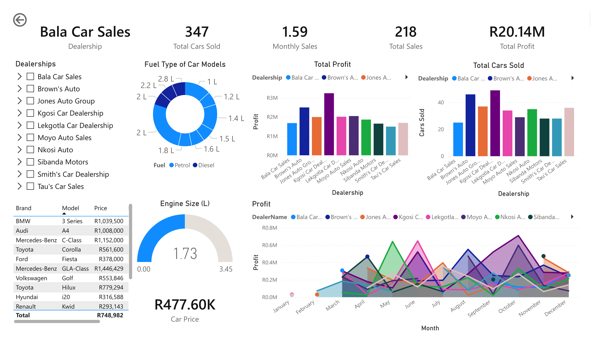

# Data Structure
The dataset used is an excel workbook that is composed of 3 sheets and they are structures as follows:

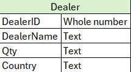
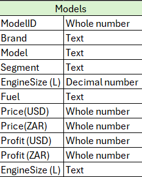
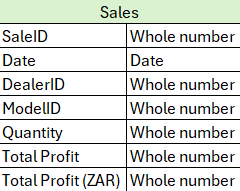

# Executive Summary
Kgosi Car Sales is the best performing dealership with a total profit of R 3,2328m generated and 49 cars sold. Brown's Auto is the second-best performing dealership, it generates R 2,493m and sold 46 cars. Moyo Auto Sales, Lekgotla Car Dealerships and Jones Auto Group performed quite similarly in terms of the profit generated but the dealerships mainly differ in car sales. Moyo Auto Sales generated R 2,043m and sold 29 cars. Lekgotla Car Dealership generated R 2,0088m and sold 34 cars. Jones Auto Group generated R 1,9926m and sold 37 cars. The profit generated by these dealerships accumulated to R11,77 million and sold 124 cars in 2022.
Here is a link to the Dashboard: https://app.powerbi.com/view?r=eyJrIjoiNjE5MmNlNmItNzRjNC00ZDIzLWE1ZGYtZDVjMTNjMmE3ZjQ0IiwidCI6IjczNjVmODNhLWViY2UtNGM5ZS1iYTI2LWY5ZjM5ZmZhYTk4ZSJ9

# Deep dive into Insights

Bala Car Sales
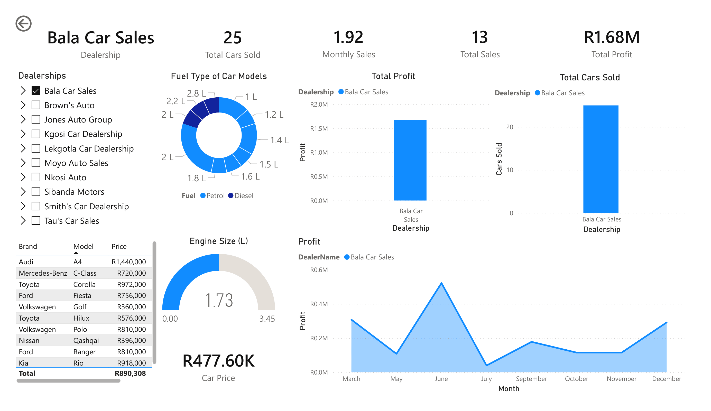

The most profitable car that was sold is the BMW X3 and it generated R 486k in profit. The least profitable car model is the Volkswagen Golf and it generated R 36k in profit. The cars with the most sales are the X3, Rio, Ranger, Polo, Fiesta and Corolla with 3 sales each. The cars with the least sales are the Qashqai, Golf and C-Class with 1 sale each.

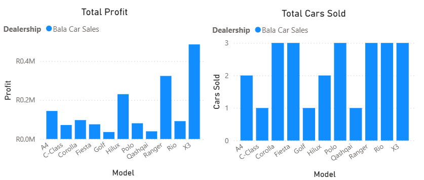

The most profitable car segment that was sold is the Pickup and it generated R 554.4k in profit. The least profitable car segment is the Hatchback and it generated R 36k in profit. The car segment with the most sales is the Sedan with 9 sales. The car segment with the least sales is the SUV with 4 sales.

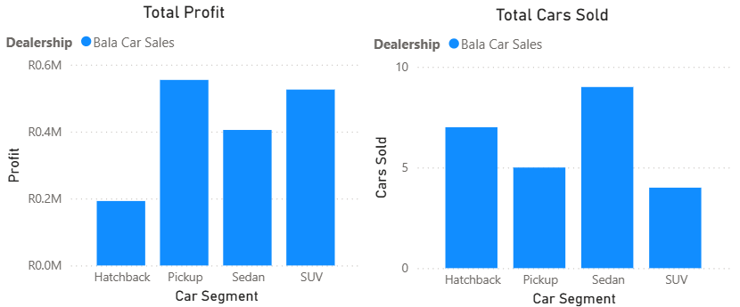

The dealership is located in Maun from Botswana and it generated R 1,6776m in profit with 25 sales in total.

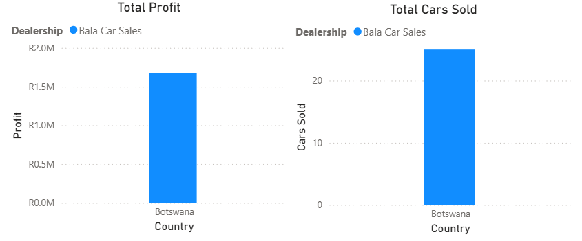
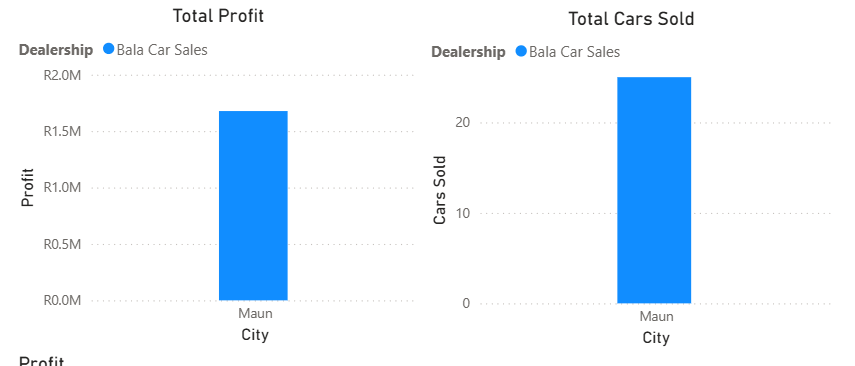

The car brand that makes the most profit is BMW with R 487k and the least profit is made by Nissan and it generated R 39,6k in total. The most sold car brand is Ford with 6 sales and Nissan has the least with 1 sale.

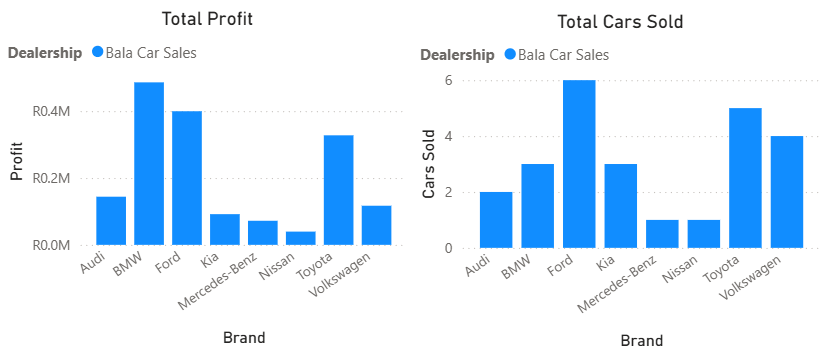

The most profitable month was in June and it generated R 522k, the least profitable month was in July and it generated R39,6k. The month with the most sales is June with 4 sales and July has the least sales with 1 sale.

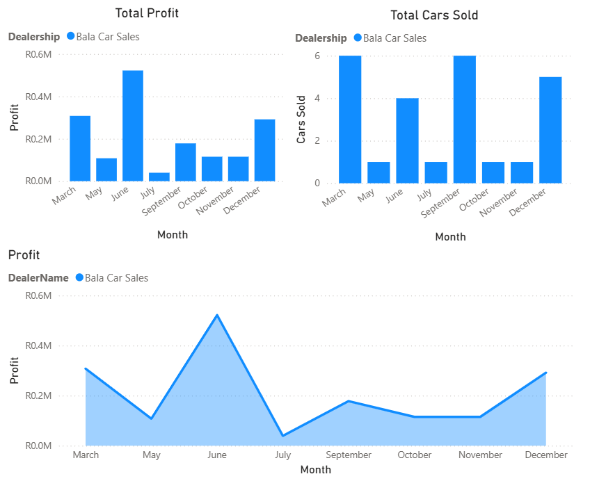

Brown's Auto
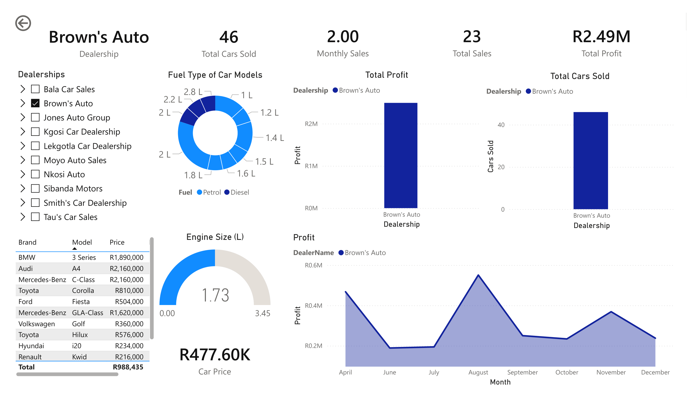

The most profitable car that were sold is the Mercedes-Benz GLA-Class and it generated R 486k in profit. The least profitable car model is the Hyundai i20 and it generated R 36k in profit. The car with the most sales GLA-Class with 6 sales and the cars with the least sales are the i20 and Hilux with 1 sale each.

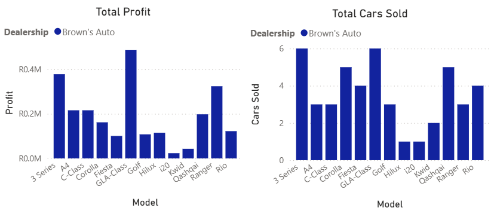

The most profitable car segment that was sold is the Sedan and it generated R 1,0944m in profit. The least profitable car segment is the Hatchback and it generated R 275.4k in profit. The car segment with the most sales is the Sedan with 21 sales. The car segment with the least sales is the SUV with 10 sales.

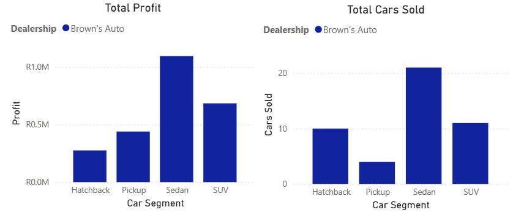

The dealership is located in Cape Town from South Africa and it generated R 1,6776m in profit with 46 sales in total.

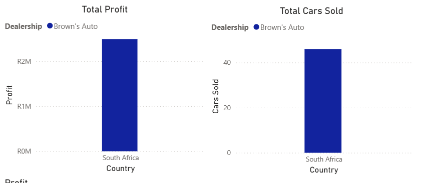
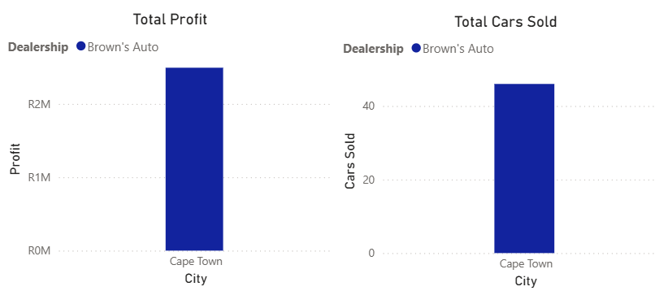

The car brand that makes the most profit is Mercedes Benz with R 702k and the least profit is made by Hyundai and it generated R 23,4k in total. The most sold car brand is Mercedes Benz with 9 sales and Hyundai has the least with 1 sale.

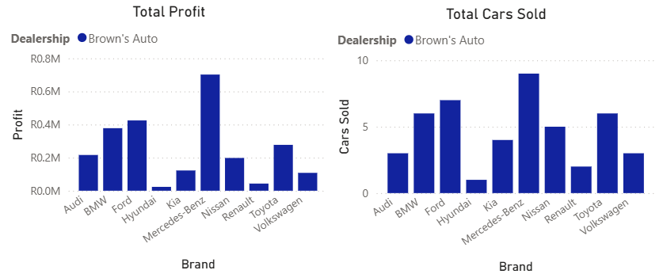

The most profitable month was in August and it generated R 558k, the least profitable month was in June and it generated R189k. The month with the most sales is August with 8 sales and June has the least sales with 3 sales.

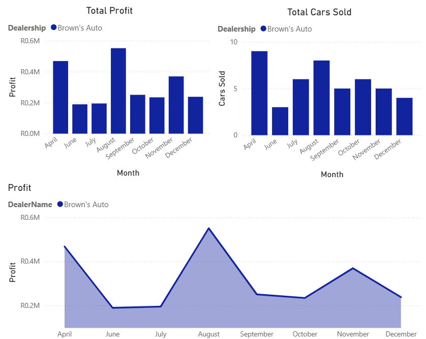

Jones Auto Group
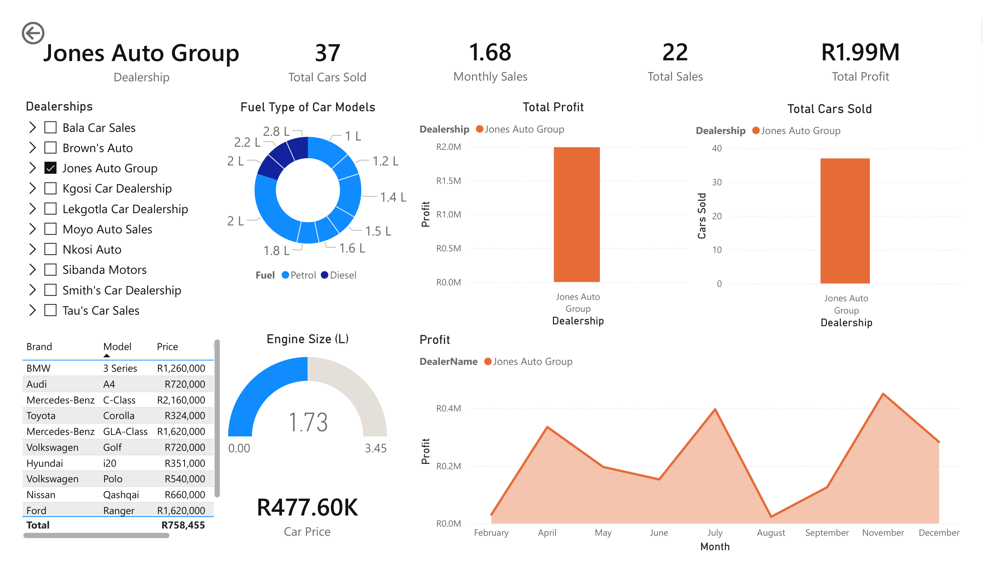

The most profitable car that were sold is the BMW X3 and it generated R 324k in profit. The least profitable car model is the Toyota Corolla and it generated R 32,5k in profit. The cars with the most sales are the i20 and Polo with 6 sales and the car with the least sales is the Corolla with 1 sale each.

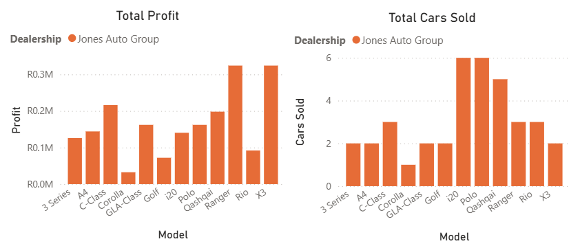

The most profitable car segment that was sold is the SUV and it generated R 684k in profit. The least profitable car segment is the Pickup and it generated R 324k in profit. The car segment with the most sales is the Hatchback with 14 sales. The car segment with the least sales is the Pickup with 3 sales.
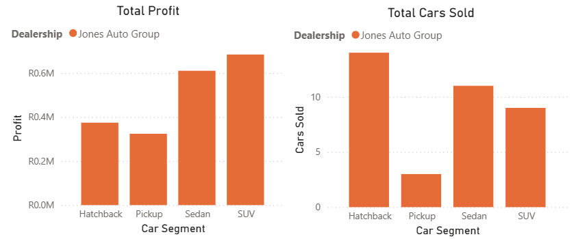

The dealership is located in Durban from South Africa and it generated R 1,9926m in profit with 37 sales in total.

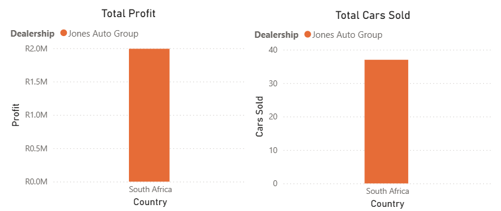
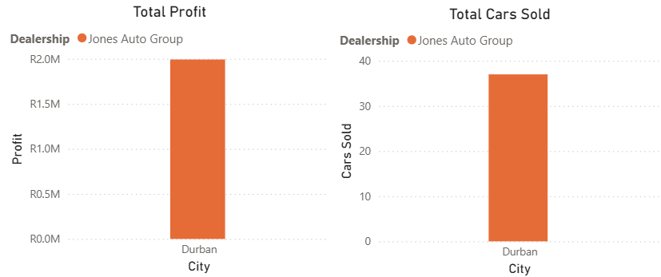

The car brand that makes the most profit BMW with R 450k and the least profit is made by Toyota and it generated R 32,4k in total. The most sold car brand is Volkswagen with 8 sales and Toyota has the least with 1 sale.

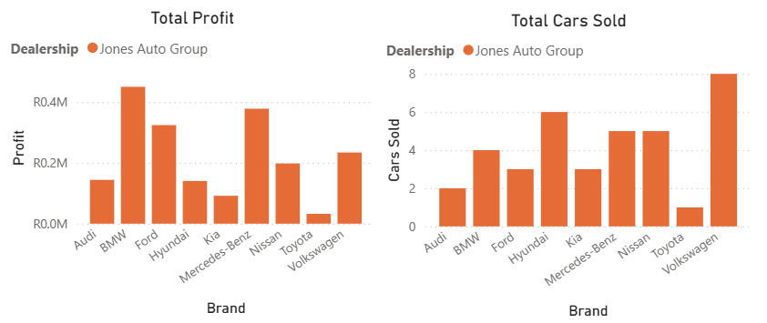

The most profitable month was in November and it generated R 450k, the least profitable month was in August and it generated R 23,4k. The month with the most sales is April with 8 sales and August has the least sales with 1 sale.

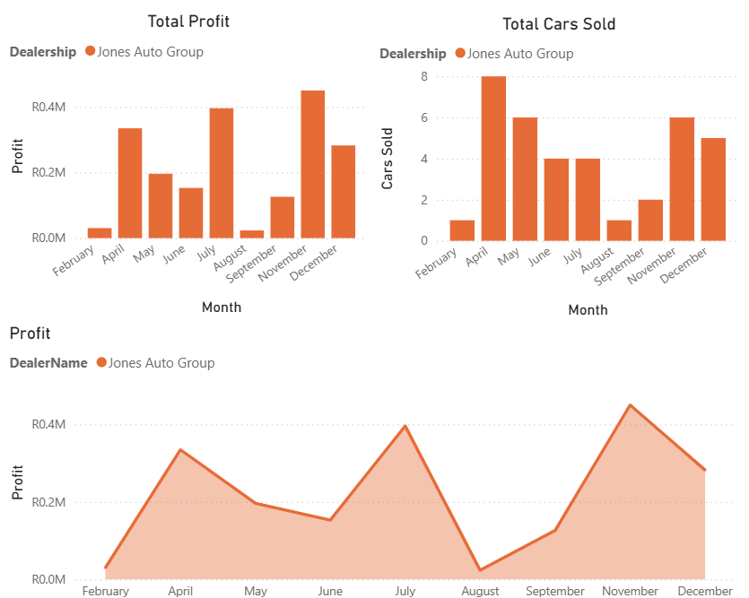

Kgosi Car Dealership
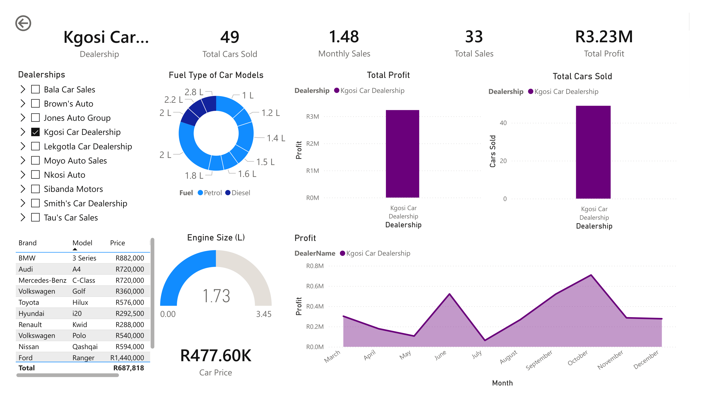

The most profitable car that were sold is the Ford Ranger and it generated R 864k in profit. The least profitable car model is the Volkswagen Golf and it generated R 36k in profit. The car with the most sales is the Ranger with 8 sales and the cars with the least sales are the C-Class and Golf with 1 sale each.

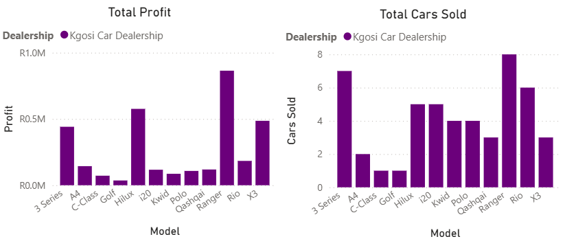

The most profitable car segment that was sold is the Pickup and it generated R 1,44m in profit. The least profitable car segment is the Hatchback and it generated R 347,4k in profit. The car segment with the most sales is the Sedan with 16 sales. The car segment with the least sales is the SUV with 6 sales.

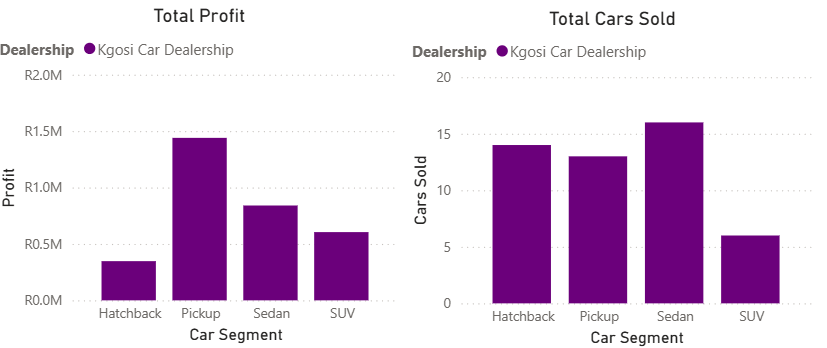

The dealership is located in Gaborone from Botswana and it generated R 3,2328m in profit with 49 sales in total.

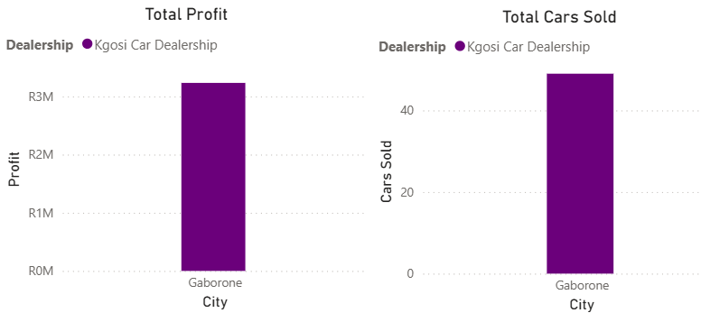

The car brand that makes the most profit BMW with R 927k and the least profit is made by Mercedes Benz and it generated R 72k in total. The most sold car brand is BMW with 10 sales and Mercedes Benz has the least with 1 sale.

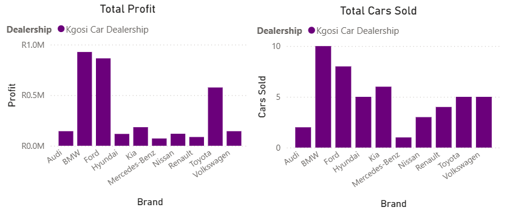

The most profitable month was in October and it generated R 709,2k, the least profitable month was in July and it generated R 63k. The month with the most sales is September with 10 sales and the months with the least sales are July and December with 2 sales each.

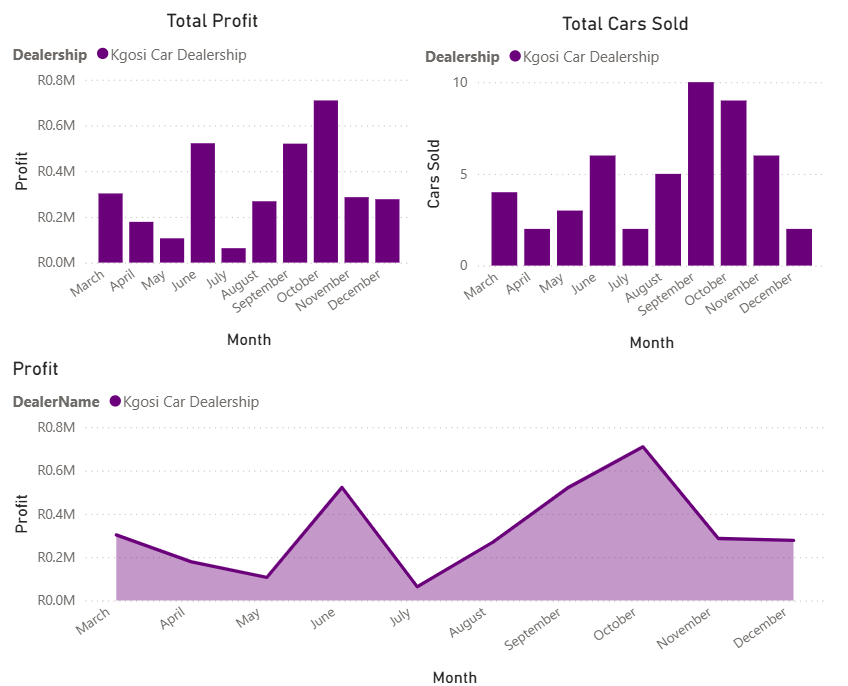

Lekgotla Car Dealership
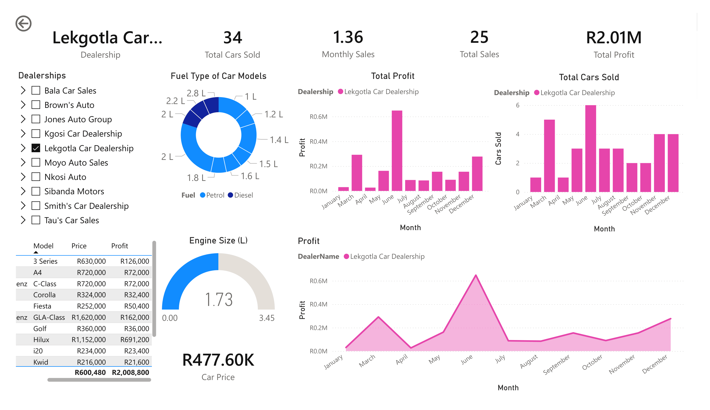

The most profitable car that were sold is the Toyota Hilux and it generated R 691,2k in profit. The least profitable car model is the Renault Kwid and it generated R 21,6k in profit. The car with the most sales is the Hilux with 21 sales and the cars with the least sales are the C-Class, A4, Corolla, Golf, i20 and Kwid with 1 sale each.

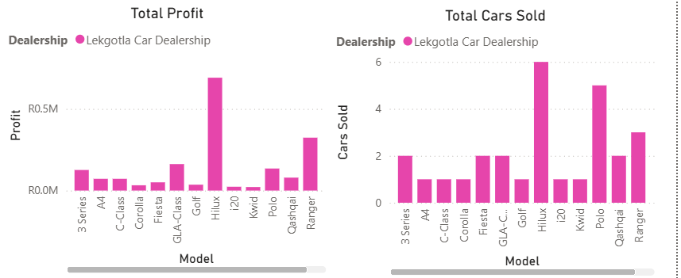

The most profitable car segment that was sold is the Pickup and it generated R 1,0152m in profit. The least profitable car segment is the SUV and it generated R 241,2k in profit. The car segment with the most sales is the Sedan with 11 sales. The car segment with the least sales is the SUV with 4 sales.

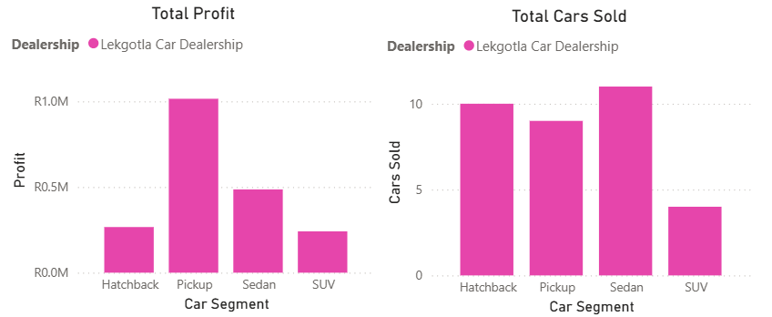

The dealership is located in Lobatse from Botswana and it generated R 2,0088m in profit with 34 sales in total.

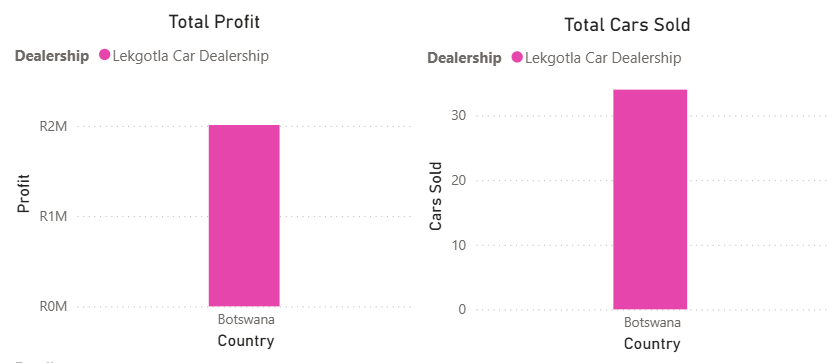

The car brand that makes the most profit is Toyota with R 723,6k and the least profit is made by Renault and it generated R 21,4k in total. The most sold car brand is Toyota with 7 sales and the least sold brands are Audi, Hyundai and Renault with 1 sale each.

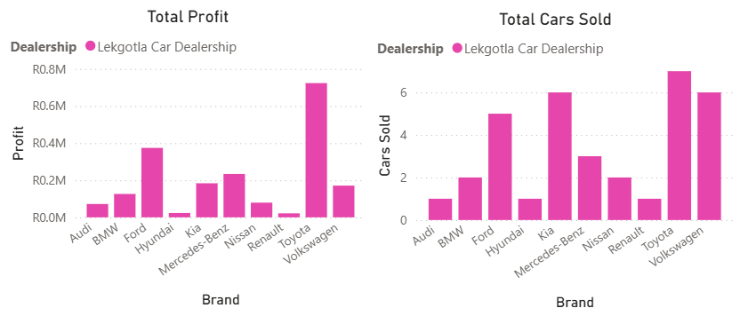

The most profitable month was is June and it generated R 648k, the least profitable month was in April and it generated R 27k. The month with the most sales is June with 6 sales and the months with the least sales are Jan and April with 1 sale each.

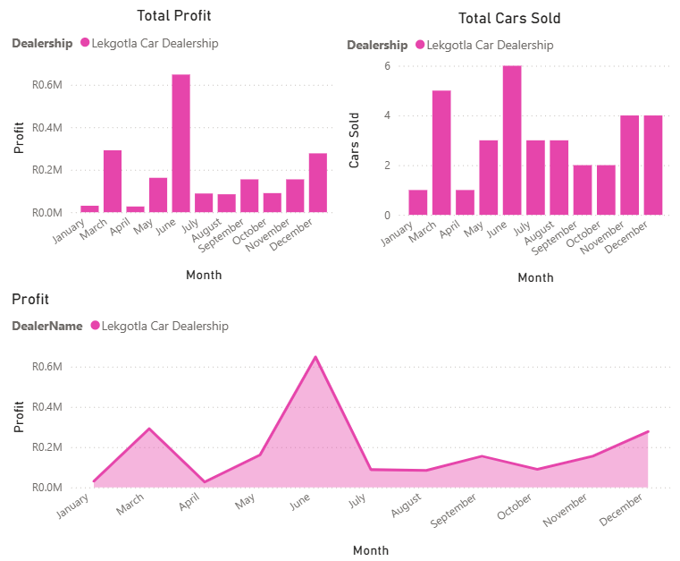

Moyo Auto Sales
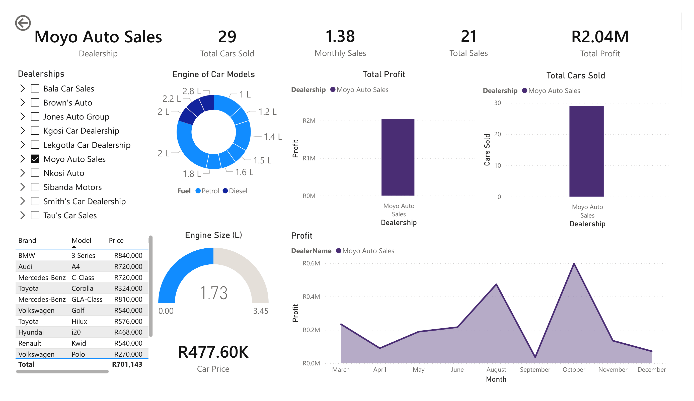

The most profitable car that were sold is the BMW X3 and it generated R 810k in profit. The least profitable car model is the Volkswagen Golf and it generated R 27k in profit. The car with the most sales is the X3 with 5 sales and the cars with the least sales are the C-Class, GLA-Class, Corolla, Hilux, Polo and Rio with 1 sale each.

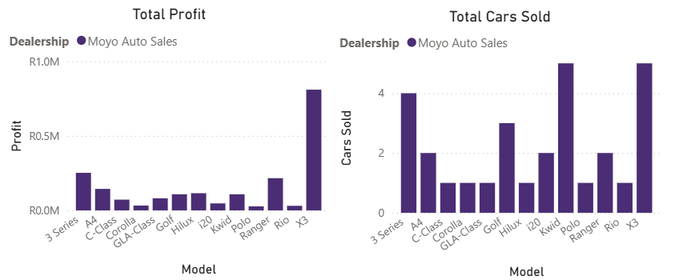

The most profitable car segment that was sold is the SUV and it generated R 891k in profit. The least profitable car segment is the Hatchback and it generated R 289,8k in profit. The car segment with the most sales is the Hatchback with 11 sales. The car segment with the least sales is the Pickup with 3 sales.

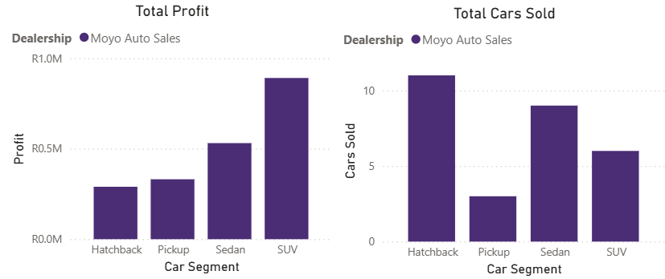

The dealership is located in Francistown from Botswana and it generated R 2,043m in profit with 29 sales in total.

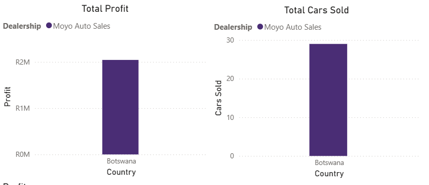
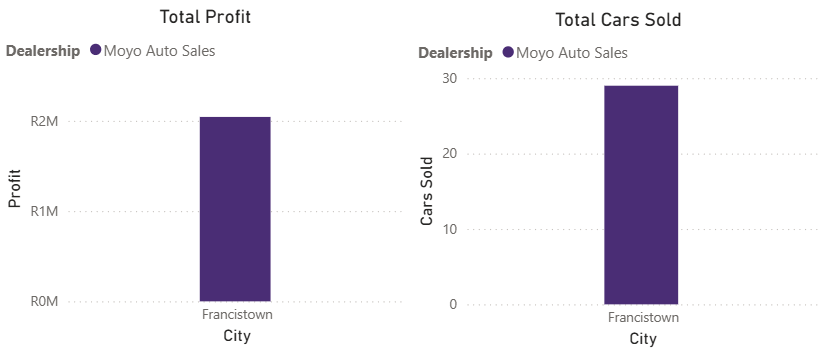

The car brand that makes the most profit is BMW with R 1,062m and the least profit is made by KIA and it generated R 30,6k in total. The most sold car brand is BMW with 9 sales and the least sold brand is KIA with 1 sale each.

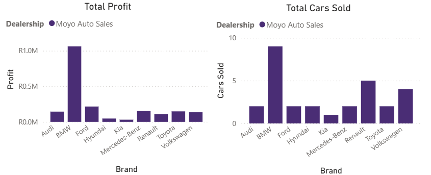

The most profitable month was is October and it generated R 597,6k, the least profitable month was in September and it generated R 36k. The month with the most sales is August with 7 sales and the month with the least sales is December with 1 sale.

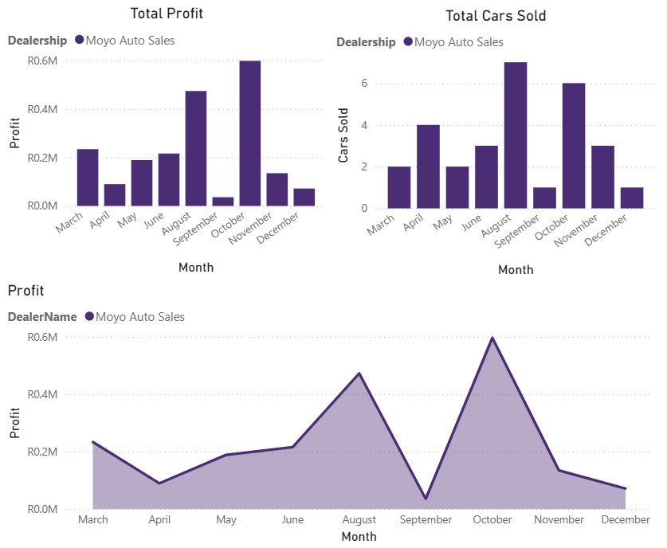

Nkosi Auto
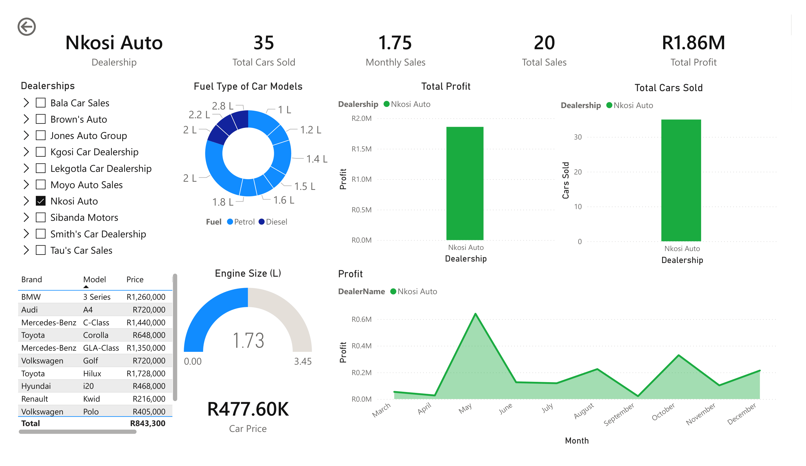

The most profitable car that were sold is the Mercedes Benz GLA-Class and it generated R 405k in profit. The least profitable car model is the Kia Rio and it generated R 30.6k in profit. The car with the most sales is the Qashqai with 6 sales and the car with the least sales is the Rio with 1 sale.

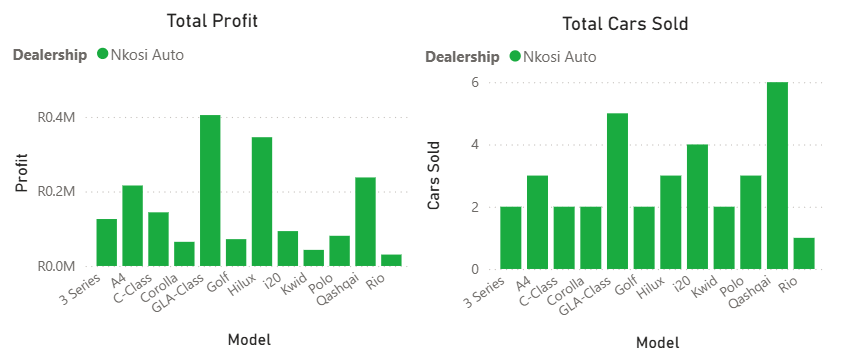

The most profitable car segment that was sold is the SUV and it generated R 642,6k in profit. The least profitable car segment is the Hatchback and it generated R 289,8k in profit. The car segment with the most sales is the Hatchback with 11 sales. The car segment with the least sales is the Pickup with 3 sales.

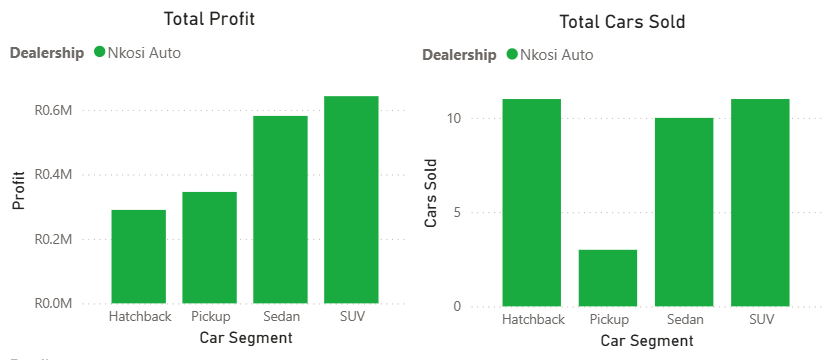

The dealership is located in Molepolale from Botswana and it generated R 1,8594m in profit with 35 sales in total.

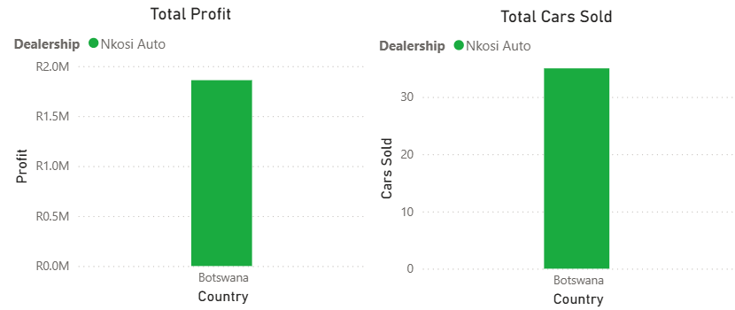
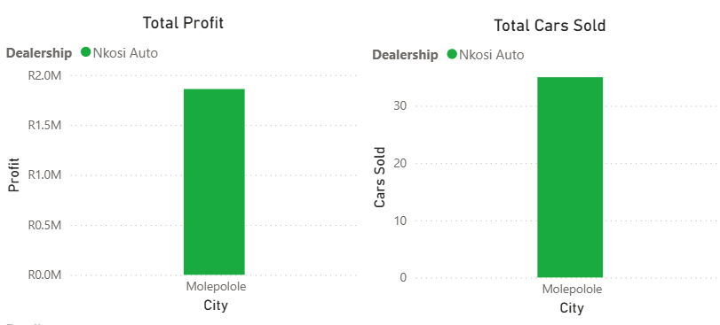

The car brand that makes the most profit is Mercedes Benz with R 549k and the least profit is made by KIA and it generated R 30,6k in total. The most sold car brand is Mercedes Benz with 7 sales and the least sold brand is KIA with 1 sale.

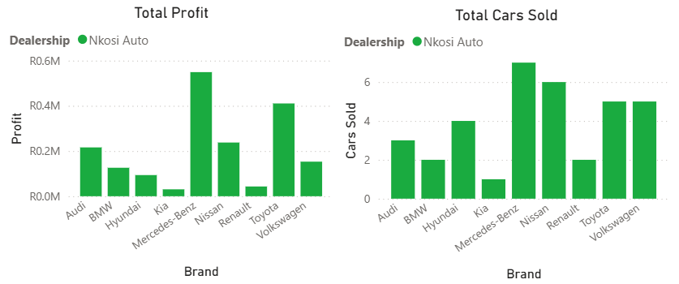

The most profitable month was is May and it generated R 640,8k, the least profitable month was in September and it generated R 21,6k. The month with the most sales is May with 9 sales and the months with the least sales are April and September with 1 sale.

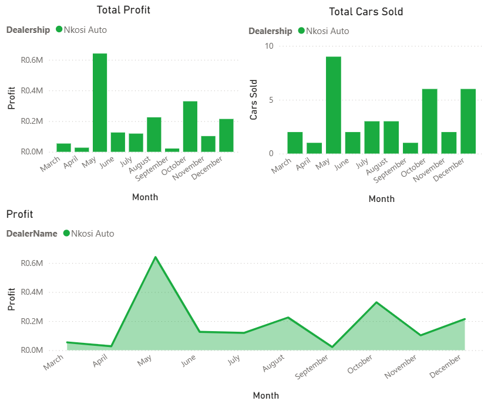

Sibanda Motors
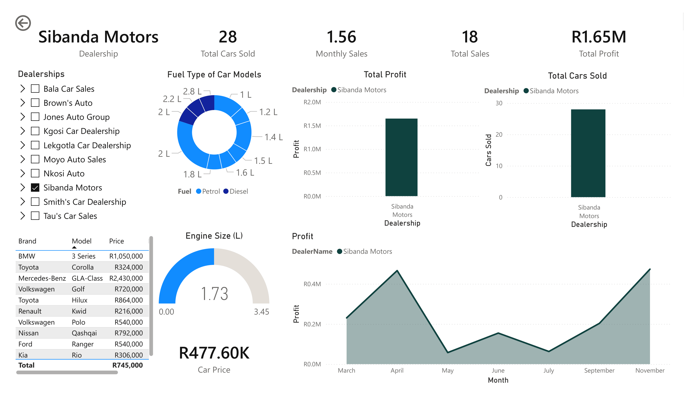

The most profitable car that were sold is the Toyota Hilux and it generated R 315k in profit. The least profitable car model is the Toyota Corolla and it generated R 32,4k in profit. The car with the most sales is the 3 Series with 5 sales and the cars with the least sales ae the Corolla, Ranger and X3 with 1 sale each.

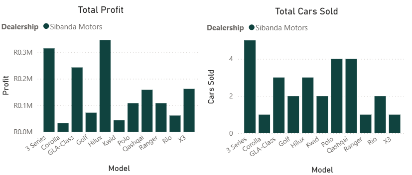

The most profitable car segment that was sold is the SUV and it generated R 563,4k in profit. The least profitable car segment is the Hatchback and it generated R 223,2k in profit. The car segments with the most sales are the Hatchback, Sedan and SUV with 8 sales. The car segment with the least sales is the Pickup with 4 sales.

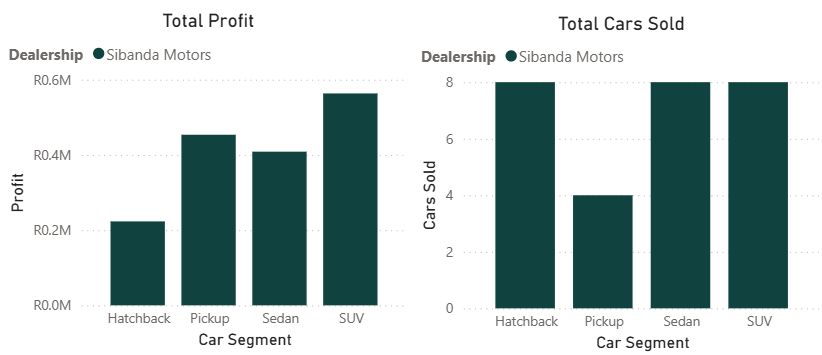

The dealership is located in Gaborone from Botswana and it generated R 1,6488m in profit with 28 sales in total.

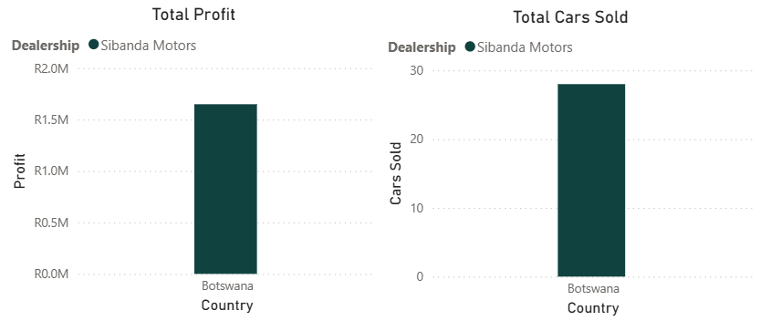

The car brand that makes the most profit is BMW with R 477k and the least profit is made by Renault and it generated R 43,2k in total. The most sold car brand is BMW with 6 sales and the least sold brand is Ford with 1 sale.

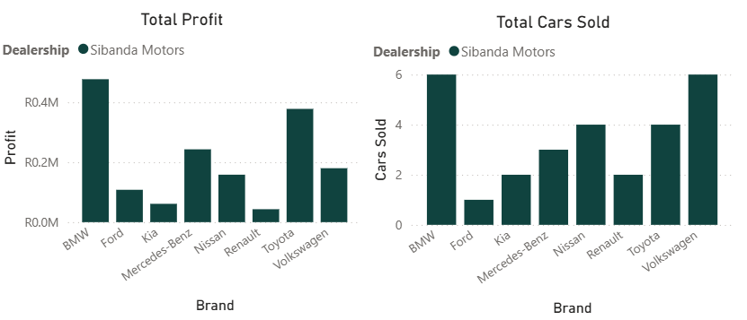

The most profitable month was in November and it generated R 640,8k, the least profitable month was in May and it generated R 21,6k. The month with the most sales is March with 7 sales and the month with the least sales is July with 1 sale.

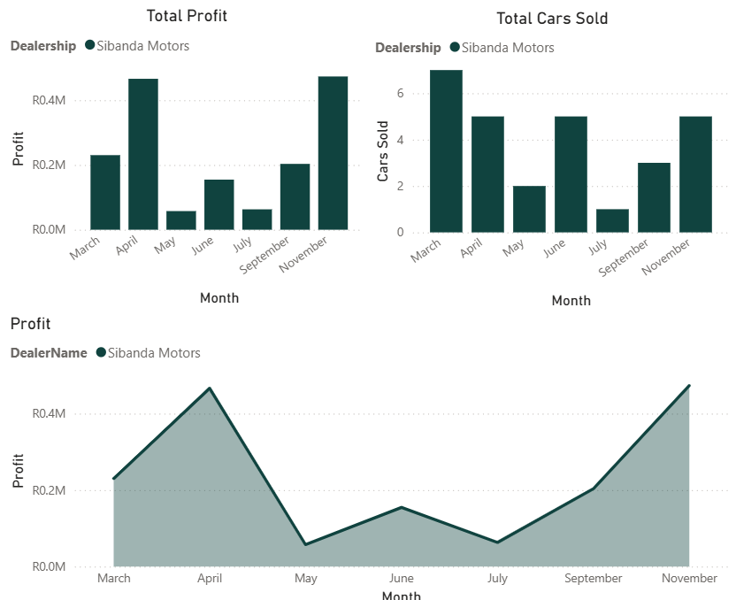

Smith's Car Dealership
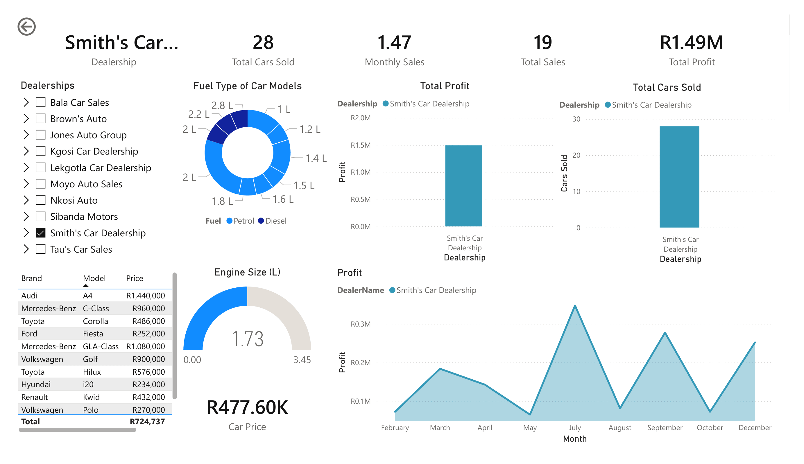

The most profitable car that were sold is the Mercedes Benz GLA-Class and it generated R 612k in profit. The least profitable car model is the Hyundai i20 and it generated R 23,4k in profit. The car with the most sales is the Golf with 5 sales and the cars with the least sales ae the Fiesta, i20, Polo and Rio with 1 sale each.

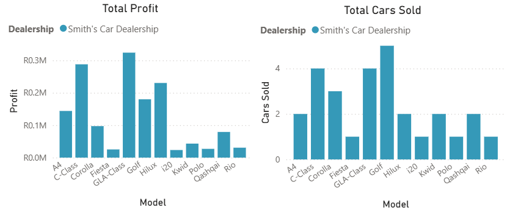

The most profitable car segment that was sold is the Sedan and it generated R 559,8k in profit. The least profitable car segment is the Pickup and it generated R 230,4k in profit. The car segments with the most sales are the Hatchback and Sedan with 10 sales. The car segment with the least sales is the Pickup with 2 sales.

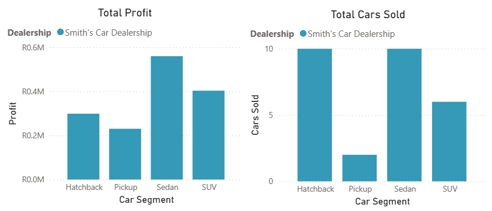

The dealership is located in Johannesburg from South Africa and it generated R 1,4922m in profit with 28 sales in total.

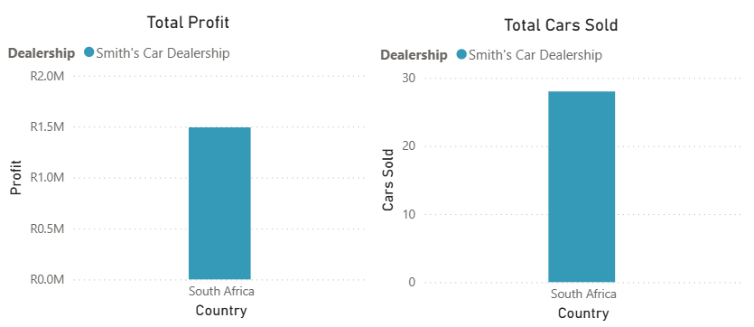
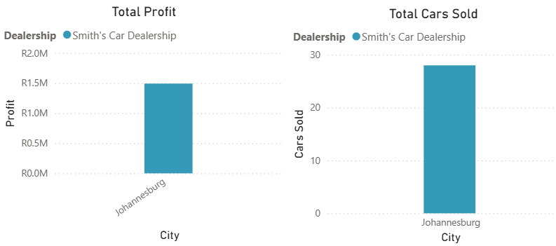

The car brand that makes the most profit is Mercedes Benz with R 612k and the least profit is made by Hyundai and it generated R 23,4k in total. The most sold car brand is Mercedes Benz with 8 sales and the least sold brands are Ford, Hyundai and Kia with 1 sale each.

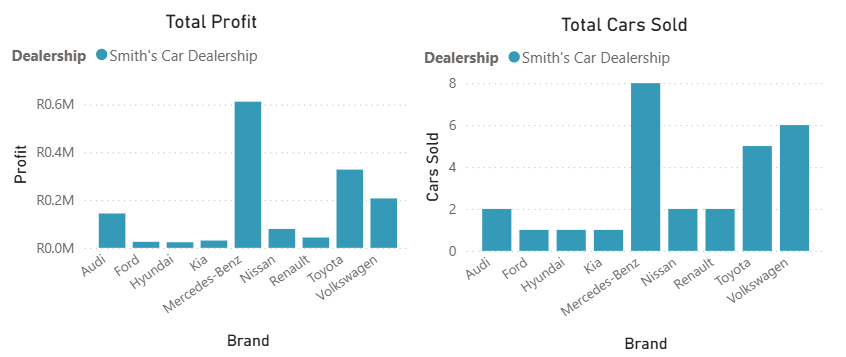

The most profitable month was is July and it generated R 347,4k, the least profitable month was in May and it generated R 64,8k. The month with the most sales is July with 8 sales and the month with the least sales are August and October with 1 sale each.

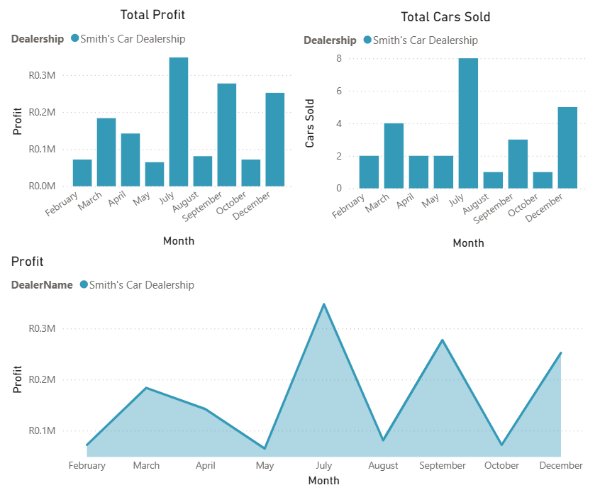

Tau Car Sales
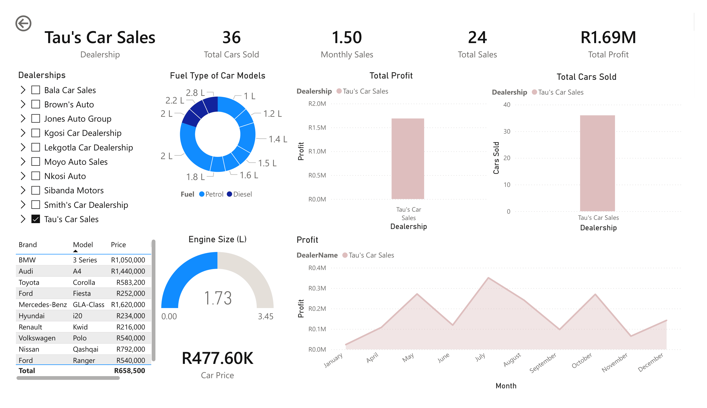

The most profitable car that were sold is the BMW 3 Series and it generated R 315k in profit. The least profitable car model is the Renault Kwid and it generated R 21,6k in profit. The car with the most sales is the Corolla with 9 sales and the cars with the least sales is the Kwid with 1 sale.

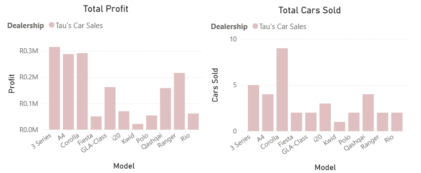

The most profitable car segment that was sold is the Sedan and it generated R 955,8k in profit. The least profitable car segment is the Hatchback and it generated R 196,2k in profit. The car segment with the most sales is the Sedan with 20 sales. The car segment with the least sales is the Pickup with 2 sales.

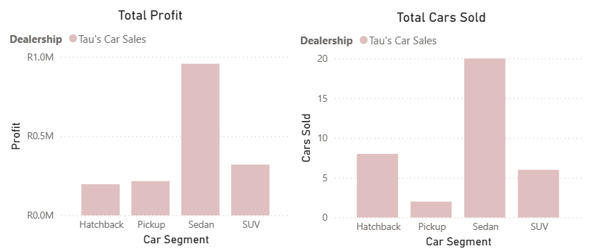

The dealership is located in Selebi-Phikwe from Botswana and it generated R 1,6684m in profit with 36 sales in total.

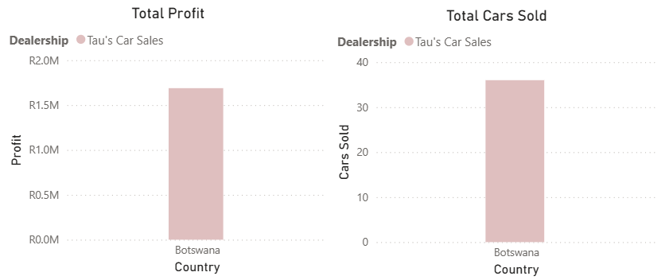
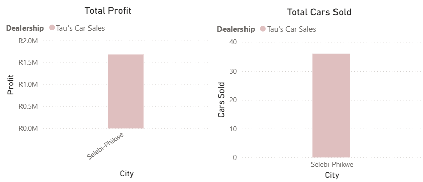

The car brand that makes the most profit is BMW with R 315k and the least profit is made by Renault and it generated R 21,6k in total. The most sold car brand is Toyota with 9 sales and the least sold brands is Renault with 1 sale each.

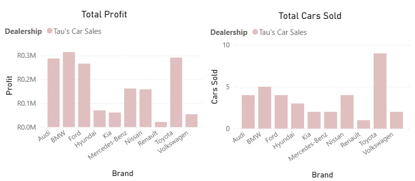

The most profitable month was is July and it generated R 351k, the least profitable month was in January and it generated R 23,4k. The month with the most sales is August with 7 sales and the month with the least sales is January with 1 sale.

Engine size based on car model
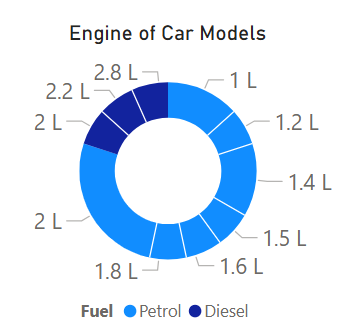

There are 4 petrol cars with a 2L engine and there is 1 petrol car each for the 1.2L, 1.5L, 1.6L and 1.8L.
There are 3 diesel cars with 1 diesel car each for the 2L, 2.2L and 2.8L.

Engine size based on car segment
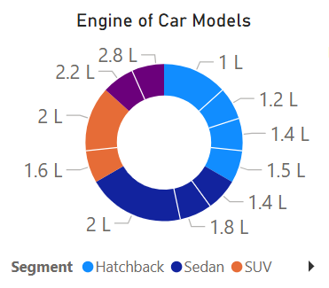

There are 2 Hatchbacks with a 1L engine and there is 1 Hatchback each for the 1.2L, 1.4L and 1.5L.
There are 3 Sedans with a 2L engine and there is 1 petrol car each for the 1.4L and 1.8L.
There are 2 SUVs with a 2L engine and there is 1 petrol car with 1.6L.
There are 2 Pickups and there is 1 petrol car each for the 2.2L and 2.8L.

# Recommendations

- Bala Car Sales
Invest in more Sedans and cars from Ford as they have the best sales. 
Promote the sales of the BMW X3 as it yields the greatest profit.

- Brown’s Auto
Invest in more Sedans and more cars from Mercedes Benz as they have the best sales.
Promote the sales of Mercedes Benz GLA-Class as it yields the greatest profit.
 
- Jones Auto Group
Invest in more Hatchbacks and cars from Volkswagen as they have the best sales.
Promote the sales of SUVs and the BMW X3 as it yields the greatest profit.

- Kgosi Car Dealership
Invest in more Sedans and cars from BMW as they have the best sales.
Promote the sales of Pickups and the Ford Ranger as it yields the greatest profit.

- Lekgotla Car Dealership
Invest in more Sedans and cars from Toyota as they have the best sales.
Promote the sales of Pickups and the Toyota Hilux as it yields the greatest profit.

- Moyo Auto Sales
Invest in more Hatchbacks and cars from BMW as they have the best sales.
Promote the sales of SUVs and the BMW X3 as it yields the greatest profit.

- Nkosi Auto
Invest in more Hatchbacks and cars from Mercedes Benz as they have the best sales.
Promote the sales of SUVs and the Mercedes Benz GLA-Class as it yields the greatest profit.

- Sibanda Motors
Invest in more Hatchbacks, Sedans, SUVs and cars from BMW as they have the best sales.
Promote the sales of SUVs, the BMW 3 series and the Toyota Hilux as it yields the greatest profit.

- Smith's Car Dealership
Invest in more Sedans, Hatchbacks and cars from Mercedes Benz as they have the best sales.
Promote the sales of Sedans and the Mercedes Benz GLA-Class as it yields the greatest profit.

- Tau Car Sales
Invest in more Sedans, cars from Toyota and the Toyota Corolla as they have the best sales.
Promote the sales of cars from BMW and the BMW 3 series as it yields the greatest profit.

